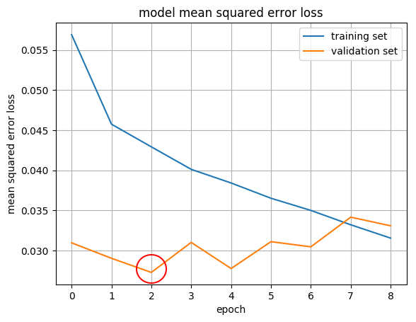

# **Behavioral Cloning** 

---

**Behavioral Cloning Project**

The goals / steps of this project are the following:
* Use the simulator to collect data of good driving behavior
* Build, a convolution neural network in Keras that predicts steering angles from images
* Train and validate the model with a training and validation set
* Test that the model successfully drives around track one without leaving the road
* Summarize the results with a written report

## Rubric Points
Here I will consider the [rubric points](https://review.udacity.com/#!/rubrics/432/view) individually and describe how I addressed each point in my implementation.  

### Files Submitted & Code Quality

#### 1. Submission includes all required files and can be used to run the simulator in autonomous mode

My project includes the following files:
* model.py containing the script to create and train the model
* drive.py for driving the car in autonomous mode
* model.h5 containing a trained convolution neural network 
* writeup_report.md summarizing the results
* run.mov a video recorded while driving one lap autonomously

#### 2. Submission includes functional code
Using the Udacity provided simulator and my drive.py file, the car can be driven autonomously around the track by executing 
```sh
python drive.py model.h5
```

#### 3. Submission code is usable and readable

The model.py file contains the code for training and saving the convolution neural network. The file shows the pipeline I used for training and validating the model, and it contains comments to explain how the code works.

### Model Architecture and Training Strategy

#### 1. An appropriate model architecture has been employed

The architecture used is the one described by Nvidia in their [End to End Learning for Self-Driving Cars](https://arxiv.org/pdf/1604.07316v1.pdf) paper and shown in the following graph:


[ELU layers](https://www.picalike.com/blog/2015/11/28/relu-was-yesterday-tomorrow-comes-elu/) were used instead of RELU to introduce nonlinearity.

#### 2. Attempts to reduce overfitting in the model

The model was trained and validated on different data sets to ensure that the model was not overfitting. Startng from the pool of data available, training and validation set has been splitted 80-20%. The model was then tested by running it through the simulator and ensuring that the vehicle could stay on track.

The model contains dropout layers, placed after the convolutional layers, to reduce overfitting.

#### 3. Model parameter tuning

The model used an adam optimizer, with the default initial learning rate of 0.001. Smaller initial rates have been tried - 0.0005 and 0.0001 - but no improvements were observed.

#### 4. Appropriate training data

I recorded training data by driving naturally at the centre of the road. I did not add recovery maneuvres from the left and right sides, specifically to see if it was possible to build a working model by just driving normally.

### Model Architecture and Training Documentation

#### 1. Solution Design Approach

The whole model was implemented in Keras.

Before opting for the Nvidia network, I tried the LeNet architecture to see if it was powerful enough to solve the problem. I obtained decent results in terms of validation loss and the network could to drive the car smoothly, but was unable to react timely when the car was getting closer to the curb.

After observing this, I decided to switch to a more complex architecture, the one proposed by Nvidia in their [paper](https://arxiv.org/pdf/1604.07316v1.pdf)

Before stepping into the details of the architecure, it's worth mentioning that, as a first step, the images are cropped (so the NN could concetrate only on the road and forget about the landscape) and the data normalized. Both activities were performed using Keras modules.

I tried different initializations methods for weights and biases, such as zeros, truncated normal, lecun uniform and glorot normal and, after observing the results, decided for the latter, that allowed the network to converge faster to smaller validation loss values.

To reduce overfitting I tried diffent combinations of dropout layers and drop probabilities. In the end, I decided to apply a 25% drop probability after each convolutional layer in the network, leaving out the fully connected layers.

####2. Final Model Architecture

As already mentioned, the architecture proposed by Nvidia in their [paper](https://arxiv.org/pdf/1604.07316v1.pdf) was used.

Here is a scheme of the architecture:

| Layer         		    |     Description	        					            | 
|:---------------------:|:---------------------------------------------:|
| Input         		    | 160x320x3 YUV image  							            |
| Cropping       		    | 65px above and 20 below						            |
| Normalization  		    | [-1, +1]              						            |
|                       |                                               |
| Convolution 5x5     	| 2x2 stride, valid padding, depth 24           |
| ELU 					        |												                        |
| Dropout               | drop prob 0.25                                |
|                       |                                               |
| Convolution 5x5     	| 2x2 stride, valid padding, depth 36           |
| ELU 					        |												                        |
| Dropout               | drop prob 0.25                                |
|                       |                                               |
| Convolution 5x5     	| 2x2 stride, valid padding, depth 48           |
| ELU 					        |												                        |
| Dropout               | drop prob 0.25                                |
|                       |                                               |
| Convolution 3x3     	| 1x1 stride, valid padding, depth 64           |
| ELU 					        |												                        |
| Dropout               | drop prob 0.25                                |
|                       |                                               |
| Convolution 3x3     	| 1x1 stride, valid padding, depth 64           |
| ELU 					        |												                        |
| Dropout               | drop prob 0.25                                |
|                       |                                               |
| Flatten				        |           									                  |
|                       |                                               |
| Fully connected		    | outputs 100              						          |
| ELU 					        |												                        |
|                       |                                               |
| Fully connected		    | outputs 50              						          |
| ELU 					        |												                        |
|                       |                                               |
| Fully connected		    | outputs 10              						          |
| ELU 					        |												                        |
|                       |                                               |
| Fully connected		    | outputs 1              						            |
| ELU 					        |												                        |

####3. Creation of the Training Set & Training Process

After recording the data by driving at the center of the road, I augmented the obtained dataset by:
* Using the images recorded by the side cameras, using a correction angle of 0.4. The choice is the result of a compromise between a good reaction when the car was getting closer to the side of the road (higher numbers) and a smooth driving (smaller numbers). In total the number of images 
* Flipping the images (and changing sign to the steering angle obviously) with a 50% probability.

By doing so, I had a total of 50367 images, of which 40290 (80%) ended up in the training set and the remaining in the validation set.

To reduce the amount of preprocessed data stored in memory, I used a generator to load and pre-process the images on the fly.

While training the model, I noticed that it was somehow difficult to predict after what number of epochs the validation loss reached its minimum. To avoid wasting time overfitting models and the having to reduce the number of epochs to get a better results, I used the callbacks "ModelCheckpoint" to keep trace of the various trained models and "EarlyStopping" to avoid overfitting uselessly.

The training and validation losses of the final models are shown as follows. The model trained in the 3rd epoch is the that has been used.


